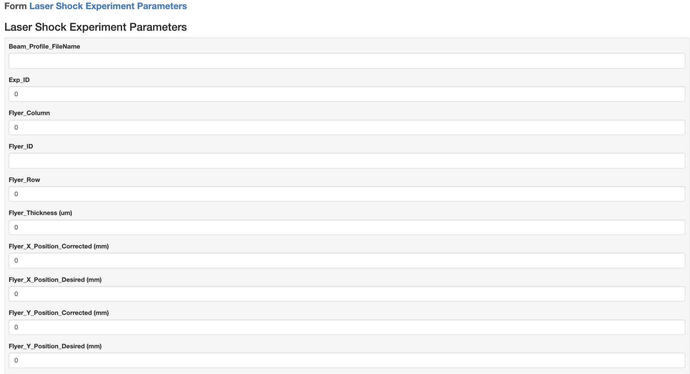

# Laser Shock Experiment 

The Laser Shock team performs experiments where flyers impact samples to study spallation behavior.  
 
 ## IGSN Integration

Each **sample** and is registered with an **International Geo Sample Number (IGSN)**.  
The IGSN acts as the backbone for linking:

- Sample identity and activity
- Laser shock experimental metadata  
- Data artefacts, like PDV trace files  
- Subsequent analysis results 

This guarantees that all data products — from raw experiment setup to processed analysis — can always be tied back to the correct sample.

## Parameters (Metadata)
Each experiment is described and stored using a **JSON Schema** that defines all the required metadata fields. 
This schema is rendered as a form on www.data.htmdec.org, allowing researchers to fill in parameters such as:

- Experiment ID and Timestamp  
- Flyer ID, material, and thickness  
- Sample ID and material (linked via IGSN)  
- Laser parameters (energy, waveplate angle)  
- PDV file name and measurement parameters  

The ingest can be done manually by entering and saving the details on the platform, or in automated fashion, like in the AIMD-L lab, where an experiment run via the central controller ensure an IGSN is provided, and all the metadata is sent to the portal via a POST call, which links everything together.

### JSON Schema and Data Accessibility

- The schema ensures **standardized metadata** across all experiments.  
- Data is **queryable and parseable** directly through the platform.  
- Metadata can be **downloaded as Excel or CSV files** for further offline analysis.  

## Data artefacts ("Data")

Output files, like PDV traces, Beam Profile images (.bmg), or camera images, are also all tracked and linked to the IGSN. They come from different sources, most streamed to data.htmdec.org, and using naming convention, linked to the apprpriate IGSN. They can be found in the **AIMD-L** or **Malone Lab** Collections, depending on the origin. 

---
